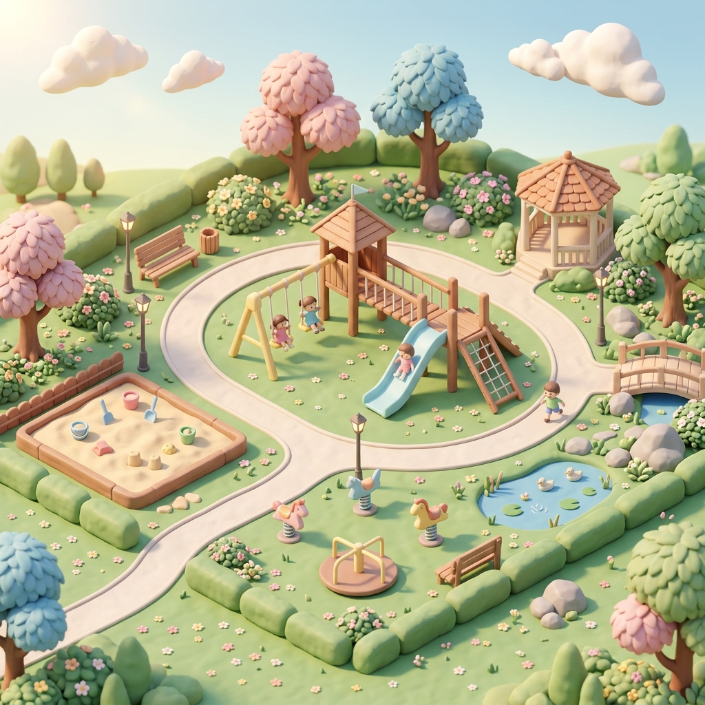

<div align="center">
  
  
  <h1>🚀 Code Quest 3D Studio</h1>
  <p><strong>A Gamified 3D Coding Platform for Kids & Beginners</strong></p>

  <p>
    
    
    
    
    
  </p>
</div>

---

## 🌟 Overview

**Coder Studio** is an open-source, visually immersive 3D coding game designed to democratize early computer science education. Traditional coding platforms often suffer from high drop-out rates due to steep learning curves and text-heavy interfaces. 

We solve this by turning abstract programming concepts (HTML, CSS, JavaScript) into tangible 3D puzzles. With our interactive grid-based level editor and Unity-style inspector, learners can visually build, experiment, and see their code come to life in real-time.

## ✨ Key Features

- 🎮 **3D Grid-Based Canvas:** An interactive, isometric 3D grid system powered by Three.js.
- 🧑‍🚀 **Dynamic Mascots (GLTF/GLB):** Place, rotate, and interact with blocky 3D characters directly on the grid.
- 🎛️ **Unity-Style Inspector:** A highly compact, professional-grade left sidebar for precise transform and scale controls, designed to mimic game engines.
- 🌗 **Dark/Light Mode Ready:** Beautifully crafted UI that respects system preferences and reduces eye strain.
- 🧩 **Gamified Mechanics:** (Coming Soon) AI-driven hint systems, interactive coding challenges, and dynamic learning paths.

## 🛠️ Tech Stack

- **Framework:** [Next.js 16 (App Router)](https://nextjs.org/)
- **UI Library:** [React 19](https://react.dev/)
- **3D Graphics:** [Three.js](https://threejs.org/) & [@react-three/fiber](https://docs.pmnd.rs/react-three-fiber/)
- **Styling:** [Tailwind CSS v4](https://tailwindcss.com/)
- **Icons:** [Lucide React](https://lucide.dev/)

## 🚀 Getting Started

Follow these instructions to get a copy of the project up and running on your local machine for development and testing purposes.

### Prerequisites

You will need **Node.js 18.x** or higher installed on your machine.

### Installation

1. **Clone the repository:**
   ```bash
   git clone https://github.com/silasakk/coder-studio.git
   cd coder-studio
   ```

2. **Install dependencies:**
   ```bash
   npm install
   # or
   yarn install
   # or
   pnpm install
   ```

3. **Run the development server:**
   ```bash
   npm run dev
   # or
   yarn dev
   # or
   pnpm dev
   ```

4. **Open your browser:**
   Navigate to [http://localhost:3000](http://localhost:3000) to see the application in action.

## 📁 Project Structure

```text
coder-studio/
├── public/                 # Static assets (3D Models, Textures, Images)
│   ├── blocky_characters/  # GLB Models & Previews
│   └── mascots/            # 2D Mascot illustrations
├── src/
│   ├── app/                # Next.js App Router pages (e.g., /player, /design-system)
│   ├── components/
│   │   ├── game/           # 3D and Game-specific UI Components
│   │   └── ui/             # Core UI framework components
│   └── ...
├── tailwind.config.ts      # Tailwind CSS configuration
└── package.json            # Project dependencies and scripts
```

## 🤝 Contributing

We welcome contributions! If you're passionate about ed-tech and open-source, here’s how you can help:
1. Fork the Project
2. Create your Feature Branch (`git checkout -b feature/AmazingFeature`)
3. Commit your Changes (`git commit -m 'Add some AmazingFeature'`)
4. Push to the Branch (`git push origin feature/AmazingFeature`)
5. Open a Pull Request

## 📝 License

Distributed under the MIT License. See `LICENSE` for more information.

---
<div align="center">
  <i>Made with ❤️ for young coders everywhere.</i>
</div>
